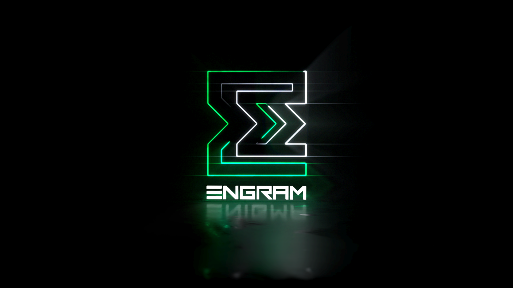

## Beta Release

### The Engram smart wallet allows easy and secure management of DERO assets. 

### Included Features
* Privately send and receive money globally
* On-chain encrypted private messaging
* Dynamically interact with smart contracts
* Native asset tracking
* Register and transfer user-friendly addresses (usernames)
* Gnomon integration for blockchain indexing
* Encrypted Notepad
* Web socket support for dApp/web3 connections
* Sign files using your wallet to guarantee authenticity
* Explore [TELA](https://github.com/civilware/tela) dApps
* Supports [EPOCH](https://github.com/civilware/epoch) protocol

### Upcoming Features
* Multi-language support
* Mobile camera support

### Releases
Engram is portable. We plan to deploy releases on the following platforms:
* Windows
* Linux
* Mac OS
* iOS
* Android

See [releases](https://github.com/DEROFDN/Engram/releases) for the latest builds.

### Build

<b>Required Processes</b>

Please see: https://developer.fyne.io/

You are required to have all the dependencies for Fyne installed. Specifically (if you are on windows), <b>TDM-GCC-64</b>.

* Install fyne cmd tools: `go install fyne.io/fyne/v2/cmd/fyne@latest`
* Add `~/go/bin` to your `$PATH` environment variable if not done already: `export PATH=$PATH:~/go/bin/`
* Clone Engram repository and navigate to its directory:

```
git clone https://github.com/DEROFDN/Engram.git
cd Engram
go mod tidy
```

#### Building for Windows

* Build from within the repo directory:
```
fyne package -name Engram -os windows -appVersion 0.6.0 -icon Icon.png
```

#### Building for Android APK (Linux)

* Install android-sdk: `sudo apt install android-sdk`
* Download r26b android NDK - https://developer.android.com/ndk/downloads
* Add environment variable for ANDROID_NDK_HOME to point at the downloaded and extracted ndk directory
* Build from within the repo directory:
```
fyne package -name Engram -os android/arm64 -appVersion 0.6.0 -appID com.engram.main -icon ./Icon.png
```

### Contributing

Issues and pull requests are welcome, but will need to be reviewed by DERO Foundation developers.

### Donations

All donations will be used for continued development and to further the scope and reach of foundation activities.

<b>DERO Address</b>

TODO
